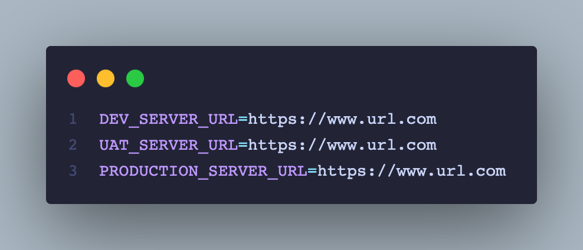
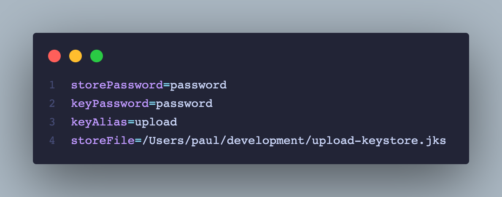

# flutter_clean_architecture_template

This Flutter Clean Architecture Repository provides a template with Domain-driven Design (DDD) architecture, incorporating best practices and patterns to create high-quality mobile applications that are scalable, maintainable, and adaptable.

## DDD Architecture

Domain-driven design (DDD) is an approach to software development that aims to create software that reflects the language and behavior of the business domain it serves. The architecture of a DDD-based system is organized around the domain, which is the subject matter of the system.

The main idea behind DDD is to separate the concerns of the domain model from the concerns of the infrastructure or technical details, such as databases, user interfaces, or frameworks. This separation makes it easier to understand, maintain, and evolve the software over time, as changes in the business domain do not affect the technical implementation, and vice versa.

The structure of a DDD-based system typically consists of several layers, each with its own responsibilities and concerns. These layers are:

- Presentation layer: The layer responsible for presenting information to the user and handling user input, such as the user interface, controllers, or views.
- Application layer: The layer responsible for coordinating the interactions between the presentation layer and the domain layer. It contains use cases, application services, and interfaces that define the behavior of the application.
- Domain layer: The layer responsible for representing the business domain, containing the entities, value objects, and domain services that define the business logic and rules.
- Infrastructure layer: The layer responsible for providing technical details, such as databases, network protocols, or external services. It contains repositories, data access objects, and other infrastructure-specific code.

DDD Architecture is important because it promotes a clear separation of concerns between the different parts of the system, making it easier to test, refactor, and evolve the codebase over time. It also helps to create a common language and understanding between developers, business stakeholders, and other stakeholders, which can lead to better communication, collaboration, and alignment between different parts of the organization. Finally, it enables the creation of more maintainable, scalable, and adaptable systems that can better meet the evolving needs of the business.

Resources:

> - Domain-Driven Design Distilled by Vaughn Vernon
> - Domain-Driven Design: Tackling Complexity in the Heart of Software by Eric Evans

## Getting Started

To get started with this Flutter Clean Architecture Repository, follow these steps:

1. Clone the repository to your local machine.
2. Create a .env file in the root directory of the project. This file should contain any private URLs or keys that your application         requires, such as API keys or database URLs. Make sure to add this file to your .gitignore file to keep these values private.
   > // .env
   
3. Create a secret.properties file in the android directory of the project. This file should contain your Android keystore properties, including your keystore location, alias, and password. You can generate a keystore file using the keytool command-line tool.  [Signing the app](https://docs.flutter.dev/deployment/android#signing-the-app)

   > // android/secret.properties
   

4. Update the dependencies and packages by running the following command in your terminal:

   ```bash
   flutter pub get
   ```

5. Launch the app on your simulator or device by running the following command in your terminal:

   ```bash
   flutter run
   ```

With these steps, you can start using the Flutter Clean Architecture Repository and take advantage of the best practices and patterns included in the template.
